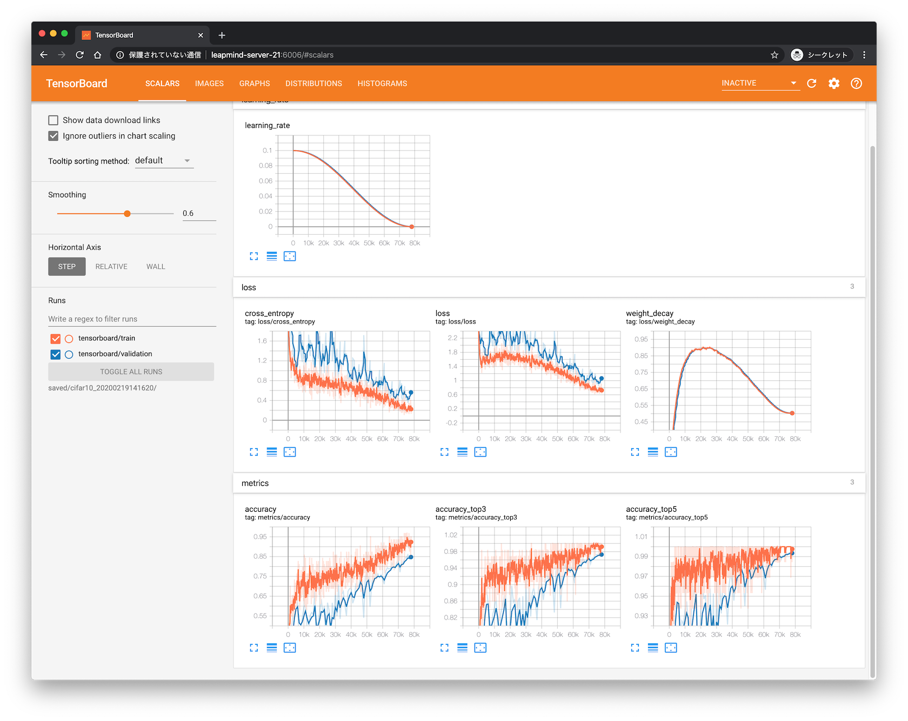

# simple-classification

## 概要

このサンプルでは、 Blueoil に含まれる `lmnet_v1` ネットワークを使って Cifar10 データセットを学習してみます。

## 学習

`cifaf10.py` には、学習用のサンプル設定ファイルが記載されています。
中には利用するネットワーククラスや、ハイパーパラメータが記載されています。
Bluoil をシンプルに利用する場合は、このような設定ファイルを用意して学習します。
`DATASET_CLASS` にはローカルのパスが書かれますので、適宜修正してください。

以下のコマンドで学習を開始できます。

```
CUDA_VISIBLE_DEVICES=0 blueoil train -c cifar10.py
```

`CUDA_VISIBLE_DEVICES` は利用する GPU の番号を `nvidia-smi` で確認のうえ設定します。

学習した結果の checkpoint ファイルは `saved` ディレクトリに保存されます。


## tensorboard

TensorBoard を使って学習の結果を確認できます。実験 ID については学習を実行した日時が入るので適宜変更します。

```
$ tensorboard --logdir saved/cifar10_20200219141620/ 
```



## 推論向けの変換

推論を実行するためには、checkpoint ファイルを実行形式に変換します。

```
$ CUDA_VISIBLE_DEVICES=-1 blueoil convert -e cifar10_20200219141620
...
optimize graph step: done!
generate code step: start
generate code step: done!
Output files are generated in saved/cifar10_20200219141620/export/save.ckpt-78125/32x32/output
Please see saved/cifar10_20200219141620/export/save.ckpt-78125/32x32/output/README.md to run prediction
```

この場合だと `./saved/cifar10_20200219141620/export/save.ckpt-78125/32x32/output`
に変換後のファイルが生成されています。

## 推論の実行

変換後のディレクトリに移動して、推論を実行します。パスは適宜読み替えてください。

```
$ cd saved/cifar10_20200219141620/export/save.ckpt-78125/32x32/output/python/
$ python run.py -m ../models/lib/libdlk_x86.so -c ../models/meta.yaml -i /storage/iizuka/cifar/test/airplane/9439_airplane.png
INFO:__main__:Function _pre_process took 0.0009694010950624943 seconds to complete
INFO:__main__:Avg(func _pre_process): 0.0009694010950624943 sec.
INFO:__main__:Function _run took 0.04132133582606912 seconds to complete
INFO:__main__:Avg(func _run): 0.04132133582606912 sec.
INFO:__main__:Output: (before post process)
[[9.9905097e-01 1.1923034e-05 1.4088467e-04 2.4520305e-05 1.2938029e-04
  1.4436200e-06 1.4132509e-06 1.2703045e-04 1.4263150e-04 3.6981868e-04]]
INFO:__main__:Function _post_process took 0.003977995831519365 seconds to complete
INFO:__main__:Avg(func _post_process): 0.003977995831519365 sec.
INFO:__main__:Output: (after post process)
[[9.9905097e-01 1.1923034e-05 1.4088467e-04 2.4520305e-05 1.2938029e-04
  1.4436200e-06 1.4132509e-06 1.2703045e-04 1.4263150e-04 3.6981868e-04]]
INFO:__main__:save json: output/output.json
INFO:__main__:save image: output/images/9439_airplane.png
INFO:__main__:Benchmark avg result(sec) for 1 trials: pre_process: 0.0009694010950624943  inference: 0.04132133582606912 post_process: 0.003977995831519365  Total: 0.046268732752650976
```

## ネットワークのテスト

`output/models/lib` に生成される elf ファイルを使い、ネットワークの入出力をテストできます。

```
$ ./lm_x86_avx.elf ../../../inference_test_data/000_images_placeholder\:0.npy ../../../inference_test_data/109_output\:0.npy 
-------------------------------------------------------------
Comparison: Default network test  succeeded!!!
-------------------------------------------------------------
TotalInitTime 17813,  sum:17.813ms
TotalRunTime 134638,  sum:134.638ms
..Convolution 49394,3504,  sum:52.898ms
....kn2row 49371,  sum:49.371ms
......kn2row-buf 2,  sum:0.002ms
......matrix_multiplication 6508,6439,5957,5701,  sum:24.605ms
......matrix_shift_add_f1 44,39,41,38,  sum:0.162ms
......matrix_shift_add_f2 6785,6283,6035,5482,  sum:24.585ms
....kn2row-1x1 3502,  sum:3.502ms
......matrix_multiplication 3500,  sum:3.5ms
..BatchNorm 5264,3497,  sum:8.761ms
..QTZ_linear_mid_tread_half 10382,  sum:10.382ms
....pack_input 5505,  sum:5.505ms
..QuantizedConv2D 7875,8579,8049,7673,7297,  sum:39.473ms
....Convert Tensor 3359,4163,3971,3798,3641,  sum:18.932ms
....Quantized Conv2D Tiling 4501,4413,4075,3873,3653,  sum:20.515ms
..Memcpy 4279,4038,3860,3736,  sum:15.913ms
..ExtractImagePatches 7,2,2,  sum:0.011ms
..QuantizedConv2D_ApplyScalingFactor 3632,  sum:3.632ms
..ReLu 3,  sum:0.003ms
..Add 1,  sum:0.001ms
..AveragePool 3513,  sum:3.513ms
..SoftMax 26,  sum:0.026ms
```


